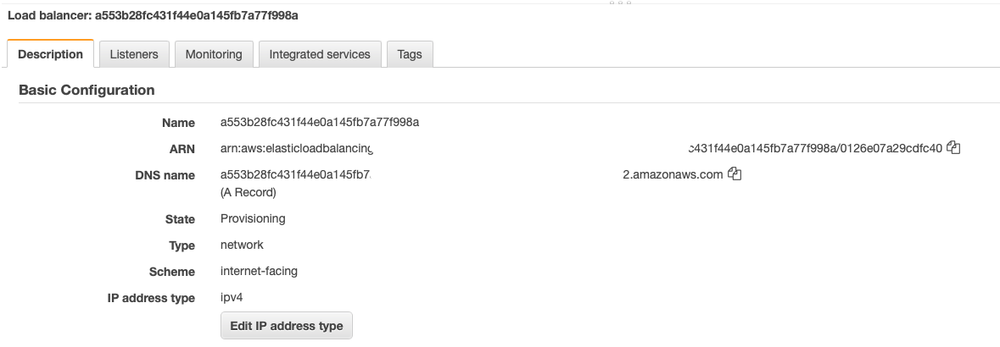

## Index

- [Summary](#summary)
  - [Observation](#observation)
- [Diagrams](#diagrams)
  - [AWS](#aws)
  - [Kubernetes](#kubernetes)
- [Prereq](#prereq)
- [Terraform](#terraform)
- [Testing](#testing)
- [Output](#output)
  - [Testing HPA](#horizontal-pod-autoscaler)
- [Destroy](#destroy)

## Summary

This project was created to be **100% automated**, which means, Terraform will create **all** AWS resources (VPC, Subnets, Route tables, IGW, NAT and EC2) and then **Ansible** will install, set **Kubernetes** up on the master and the EC2 nodes and deploy the **Nginx Ingress**, **WordPress** and **Bananas** apps as soon as Terraform finishes the deployment without the need to update any file, but before this make sure you've done all [prereqs](#prereq).

### Observation

Terraform will create the MySQL RDS as well as export the endpoint to **Ansible** to be used on **WordPress** Deployment. Also, the RDS password for the user, _wpmysql_, will be created via **Terraform** as well as the password via SSM Parameter, secure string, and then as soon as **Ansible** starts the deployment, it'll grep this password and store it in a variable to be used on WordPress Deployment as well.

Therefore, sensitive data won't be exposed.

## Diagrams

# AWS


# Kubernetes


## Prereq

These tools were installed locally.

- <a href="https://docs.aws.amazon.com/cli/latest/userguide/cli-chap-install.html">AWS Cli</a>
- <a href="https://learn.hashicorp.com/tutorials/terraform/install-cli">Terraform</a>
- <a href="https://docs.ansible.com/ansible/latest/installation_guide/intro_installation.html">Ansible</a>

:warning: Make sure to check out the below information.

> 1. Make sure the file in _/group_vars/all/default.yml_ is updated according to your infrastructure.

> 2. Update the file _ansible.cfg_, parameter _private_key_file_ to your EC2 key pair in the _Dev_ directory. This Key Pair will be used to access the EC2 by Ansible.

```bash
[defaults]
inventory=./inventory/hosts
host_key_checking=false
private_key_file= path_to_your_key_pair (eg. /myfolder/mykey.pem)
```

> 3. Update **key_pair_name** variable on _main.tf_ file in the Dev directory to your EC2 key pair.

## Terraform

**Terraform project**


### terraform init

Update the _main.tf_ file in the _Dev_ directory if you want to change any AWS resource name.

Access the Dev folder and run `terraform init` to initialize the project.


### terraform plan

Access the Dev folder and run `terraform plan` to check out any issue.

### terraform apply

Once it’s OK, run `terraform apply`

## Testing

Wordpress Website


Banana website


## Output

Ansible Deployment


AWS Nginx Network Load Balancer


K8s svc


K8s Pods


AWS RDS


AWS SSM Parameter


## Horizontal Pod Autoscaler


Running the below command in a couple of terminal windows, we can stress the environment and then test the HA.

```bash
while true; do curl http://my-website.ugulino.com -v; echo; done
```

As soon as the CPU will be consumed more than 50%, the pods will scale up.


As soon as the CPU will be consumed less than 50%, the pods will scale down.


# Destroy

You can destroy your environment running the below command.

```bash
terraform destroy
```
